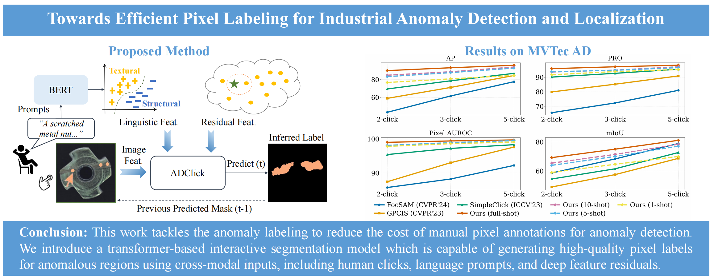

# ADClick

Official PyTorch implementation of [Towards Efficient Pixel Labeling for Industrial Anomaly Detection and Localization](https://arxiv.org/abs/2407.03130).

Current paper status: **Pattern Recognition Letters (under review)**.

## Overview




## Repository Layout

- `train.py`: training entry point.
- `scripts/evaluate_model.py`: evaluation entry point.
- `isegm/data/datasets/`: dataset definitions, including `mvtec_cls_prompt`, few-shot, and 10-shot variants.
- `REST/`: prompt and residual-related utilities.

## Environment

This codebase was originally developed with PyTorch and the dependencies listed in `requirements.txt`:

```bash
pip install -r requirements.txt
```

The pinned requirements in this repository are:

- `matplotlib==3.3.4`
- `setuptools==52.0.0`
- `PyYAML==6.0`
- `easydict==1.9`
- `tensorboard==2.8.0`
- `opencv-python-headless==4.5.3.56`
- `albumentations==0.5.2`
- `mmcv==1.6.2`
- `timm==0.6.11`
- `Cython==0.29.32`

`torch` and `torchvision` are not pinned in `requirements.txt`; choose versions compatible with your CUDA environment and `mmcv==1.6.2`.

## Data Preparation

### 1. Configure dataset and pretrained model paths

The main paths are defined in `config.yml`:

```yaml
INTERACTIVE_MODELS_PATH: "./weights"
EXPS_PATH: "model_posfar/no_ok"
MVTEC_PATH: "/home/Jingqi/AD/Data/defect_1024/mvtec"
IMAGENET_PRETRAINED_MODELS:
  SIMPLE_CLICK: "/home/Jingqi/AD/pretrained/cocolvis_vit_base.pth"
```

Before training or evaluation, update these paths to match your local environment.

### 2. Prepare prompt resources

The original README referenced external prompts:

- Prompt download: [BaiduDisk](https://pan.baidu.com/s/1s92XlhdW7lJNJ3kNjRBVSA?pwd=xakv)

If your experiment depends on prompt-based MVTec datasets such as `mvtec_clsprompt`, make sure these prompt resources are prepared before training or evaluation.

### 3. Optional preprocessing / residual feature generation

The original experiments also used preprocessing code under `REST/` and PCR generation commands. Those commands were highly environment-specific and used absolute local paths. Keep them as a reference only unless you have the same data layout.

## Training

Before training, download the SimpleClick pretrained model from:

- [SimpleClick pretrained models (Google Drive)](https://drive.google.com/drive/folders/1zVhZefCjsTBxvyxnYMVnbkrNeRCH6y9Y?usp=sharing)

Then place the checkpoint at the path referenced by `IMAGENET_PRETRAINED_MODELS.SIMPLE_CLICK` in `config.yml`, or pass it explicitly with `--weights`.

The main training entry point is:

```bash
python train.py <model_config.py> --category <category> [other args]
```

Important arguments:

- `model_path`: path to the model config script.
- `--category`: MVTec category, for example `bottle` or `carpet`.
- `--batch-size`: overrides the batch size defined by the model config.
- `--gpus` or `--ngpus`: GPU selection.
- `--workers`: dataloader worker count.
- `--weights`: optional pretrained checkpoint.

### Example: iterative mask training on MVTec

```bash
WEIGHT=/path/to/cocolvis_vit_base.pth
python train.py models/iter_mask/zero_conv_plainvit_base448_mvtec_itermask_clsprompt.py \
  --batch-size 8 \
  --gpus 0 \
  --workers 8 \
  --category bottle \
  --weights "$WEIGHT"
```

### Example: category loop

```bash
for item in bottle cable capsule hazelnut metal_nut pill screw transistor toothbrush zipper; do
  python train.py models/iter_mask/zero_conv_plainvit_base448_mvtec_itermask_clsprompt.py \
    --batch-size 8 \
    --gpus 0 \
    --workers 8 \
    --category "$item" \
    --weights /path/to/cocolvis_vit_base.pth
  sleep 30
done
```

## Evaluation

The main evaluation entry point is:

```bash
python scripts/evaluate_model.py NoBRS --checkpoint <checkpoint> --datasets <dataset>
```

Important arguments:

- `mode`: one of `NoBRS`, `RGB-BRS`, `DistMap-BRS`, `f-BRS-A`, `f-BRS-B`, `f-BRS-C`.
- `--checkpoint` or `--exp-path`: checkpoint source.
- `--datasets`: dataset name, for example `mvtec_clsprompt`.
- `--gpus` or `--cpu`: device selection.
- `--n-clicks`: maximum number of clicks.
- `--category`: target MVTec class.
- `--task`: `click`, `sup_ad`, or `un_ad`.
- `--cls-prompt-index`: fixes the prompt index during evaluation.
- `--few-shot`: controls few-shot evaluation for prompt datasets.

```bash
MODEL_PATH=/path/to/checkpoints/006.pth
python scripts/evaluate_model.py NoBRS \
  --gpus 0 \
  --checkpoint "$MODEL_PATH" \
  --eval-mode cvpr \
  --datasets mvtec_clsprompt \
  --logs-path logs/mvtec_zero_conv_clsprompt \
  --n-clicks 20 \
  --category bottle \
  --target-iou 1
```

Evaluation results are appended to CSV files under the specified `logs-path`.

## Acknowledgements

This work builds on prior open-source projects, especially [SimpleClick](https://github.com/uncbiag/SimpleClick).

## Citation

If you find this work useful, please cite:

```bibtex
@article{li2024towards,
  title={Towards efficient pixel labeling for industrial anomaly detection and localization},
  author={Li, Hanxi and Wu, Jingqi and Wu, Lin Yuanbo and Chen, Hao and Liu, Deyin and Shen, Chunhua},
  journal={arXiv preprint arXiv:2407.03130},
  year={2024}
}
```
